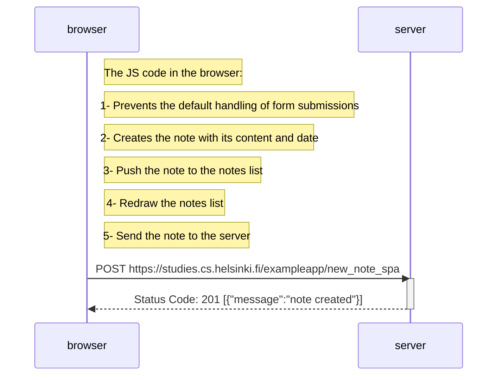

The user <b>creates a new note</b> in the single-page application version

```mermaid
sequenceDiagram
    participant browser
    participant server

    Note right of browser: The JS code in the browser:
    Note right of browser:1- Prevents the default handling of form submissions
    Note right of browser:2- Creates the note with its content and date
    Note right of browser:3- Push the note to the notes list
    Note right of browser:4- Redraw the notes list
    Note right of browser:5- Send the note to the server
    browser->>server: POST https://studies.cs.helsinki.fi/exampleapp/new_note_spa
    activate server
    server-->>browser: Status Code: 201 [{"message":"note created"}]
    deactivate server
    
```